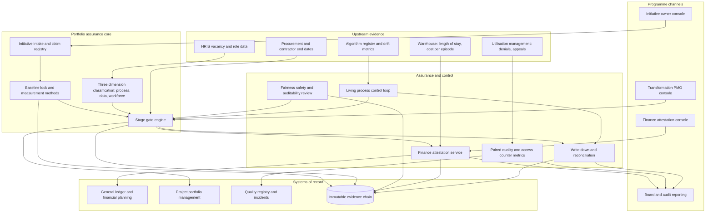

# Trueup

**Source:** `ai-in-health/Accenture-Healthcare-Walking-the-AI-Talk/`
**Domain:** `ai-health`
**One-liner:** A benefits-realisation system of record for health-system AI portfolios that turns every announced initiative into a baselined claim with an accountable business owner, a finance-attested realised value, and stage gates that stop a pilot being reported as a delivered outcome.
**Wedge:** The first 12–24 months after a US payer, provider or pharmacy benefit manager stands up an AI or digital transformation programme office carrying 10–40 concurrent initiatives against a savings number the board has already heard — precisely the population the source surveyed (62 of its 1,075 respondents were from US payers, providers and PBMs).
**Positioning:** Benefits assurance for clinical and administrative AI. Its unit of account is the *promise made to the board*, not the model: project portfolio tools track spend and milestones, MLOps platforms and algorithm registers track model state and validation, and none of them can answer the CFO's only question, which is how much of the announced AI benefit has landed in the general ledger. Trueup makes the claim, the locked baseline, the measurement method and the finance attestation a single governed object; it consumes validation and drift state from whatever register already holds it rather than duplicating that inventory; and it treats the "living process" the source champions as something with a named drift owner and a re-baselining obligation rather than a go-live date.

## Market research synthesis

### Thesis from source

The source reports the Accenture 2017 Process Reimagined Survey — 1,075 process professionals from large global companies across 13 industries and 15 countries, fielded in late 2016 and early 2017, with 62 respondents drawn from US payers, providers and pharmacy benefit managers. Its finding is that healthcare, counter-intuitively, leads: at 15 percent it ties Mining and Minerals for first place on "process reimagined" — applying machine learning simultaneously across process, people and data — against a 9 percent all-industry average, with Telecom and Retail at 13 percent, Insurance and Banking at 10 percent, Public Service at 9 percent, Manufacturing, CPG and IT at 8 percent, Oil and Gas and Chemicals at 7 percent, and Metals at 5 percent. Healthcare ranks first specifically on Process and on Data. Within healthcare, 42 percent are using machine learning to reimagine processes and process change, 42 percent are using it in at least one business process, 42 percent are using it to transform the human-machine work relationship, and 52 percent are harnessing data to create exponential improvements in speed and KPIs.

The benefit claims are large and uniformly self-reported. Fifty-one percent of healthcare organisations say machine-learning-enabled processes have cut the cost to "service products after sales" by at least 50 percent. Sixty-five percent say revenue improved by 10 to 20 percent from using machine learning to "understand markets, customers and capabilities." Ninety-three percent strongly agree or agree that these processes help achieve previously hidden or unobtainable value (45 percent strongly agree, 48 percent agree), and 86 percent believe they find solutions to previously unsolved business problems (47 percent strongly agree, 39 percent agree). Ninety-one percent report seeing 200 percent improvement in KPIs in enterprise processes and 77 percent report doubling KPIs for sales and marketing in the front office. Penetration by process category runs: manage information technology 50 percent, deliver physical products 48 percent, develop and manage human capital 47 percent, manage financial resources 45 percent, develop and manage business capabilities 45 percent, and develop and manage products and services 45 percent. On workforce, 82 percent are buying capability by hiring experienced machine-learning talent away from other companies, and 91 percent and 87 percent respectively agree with the propositions that augmentation will mean managing far more process variability and that machine-learning-enabled processes will personalise work itself.

The document then concedes its own weakness in a single sentence that is the entire commercial opening: "Some AI initiatives are pilots and therefore deliver benefits on a small scale." Every figure above was supplied by a process professional, not attested by a finance function. A claim such as "91 percent seeing 200 percent improvement in KPIs" cannot survive an audit committee unless somebody has named the baseline, the measurement window, the counterfactual, and the general-ledger line or actuarial trend where the value appears. In practice health systems announce an AI savings number, run a pilot in one unit, declare it a success, and never reconcile the announcement to the operating budget it was supposed to reduce. The gap between announcement and audited value is what this product closes. Usefully, the source also hands over the governance frame: the three dimensions to manage are process change, data and data models, and workforce, and the four workforce moves are enlisting the C-suite to remake the culture with AI, helping employees keep pace, emphasising distinctively human capabilities when hiring, and "making sure that algorithmic decisions are ethical, fair, safe and auditable."

The paper's substantive argument is that automation yields a short-term jump in productivity and speed which then levels off, and that durable value comes only from "living processes" — self-adapting, self-optimising procedures that sense, comprehend, act and learn in real time, in which "machines themselves will become agents of process change." Its three examples show what that looks like in health specifically: Ayasdi analysing electronic medical record data for clinical variation management on common surgical procedures, automatically surfacing groups of similar patient procedures and generating clinical pathways for better outcomes at lower cost; the Tampere City Department of Social Services and Health Care in Finland capturing facility data to monitor patients, enhance service and improve onsite safety; and HealthTap's Dr. A.I. translating a person's symptoms into personalised, doctor-recommended courses of action. Each of those has a real health-economics denominator — length of stay, cost per episode, readmission penalty exposure, onsite safety incidents — and each will drift. A living process therefore needs a permanent owner and a drift trigger, not a project closure memo. Holding a health-system AI portfolio to that standard, initiative by initiative, gate by gate, attestation by attestation, is the product.

### Buyer & economic model

- **Primary buyer:** the Chief Financial Officer, co-sponsored by the Chief Digital or Chief Transformation Officer, at a health system, health plan or PBM; in a payer the co-sponsor is usually the COO who owns administrative cost ratio.
- **Users:** transformation and PMO leads (daily), initiative business owners such as service-line medical directors, revenue-cycle directors, utilisation-management leads and claims operations managers (weekly), finance business partners and internal audit (monthly attestation cycle), workforce planning and HR business partners (role redesign and capability transfer), the algorithmic accountability or AI ethics committee (gate reviews), the clinical quality and safety office (counter-metrics), and the board's audit and quality committees (reporting).
- **Budget owner / value metric:** the transformation or capital programme budget, defended against the operating budget it promised to shrink. The value metric is **finance-attested realised value per dollar of AI programme spend**, paired with the share of announced benefit that has been either attested or formally written down — no claim is allowed to sit in limbo indefinitely.
- **Competing status quo:** a project portfolio tool tracking milestones and burn, a benefits tracker in a spreadsheet maintained by the PMO using numbers supplied by the same initiative owners whose performance depends on them, a consultant-built business case never revisited after approval, MLOps dashboards showing model health with no financial translation, and a board deck whose savings figure is simply the sum of the original business cases.

### Domain constraints

- **Regulatory / trust / safety:** clinical initiatives drag software-as-a-medical-device questions into the benefit case, so value accruing from a model whose clinical validation has lapsed is not value. Payer-side utilisation management and prior-authorisation automation sits under active regulatory and legislative scrutiny, which means denial rates and appeal-overturn rates are a binding constraint on any savings claim rather than a side report. The source's own instruction that algorithmic decisions be "ethical, fair, safe and auditable" has to become a hard gate: an initiative with unmeasured subgroup impact cannot open its value gate. And labour-derived savings must always be reported beside quality, safety and access indicators for the same process, because a cost reduction that moves harm or waiting time elsewhere is a transfer, not a saving.
- **Data sensitivity:** benefit measurement requires joining claims, the general ledger, the EHR, payroll and the quality registry — exactly the join privacy review resists. The platform should hold cohort definitions and aggregates rather than patient-level extracts, and where patient-level linkage is genuinely needed for attribution it needs a documented HIPAA basis and limited-data-set discipline. Workforce and headcount data used for role redesign is employee-sensitive and must be access-segregated from initiative value reporting.
- **Change-management realities:** initiative owners will never volunteer a write-down, so the write-down must be a scheduled, blameless governance event with its own gate rather than a confession extracted under pressure. Finance will not attest to anything it cannot tie to a ledger line or an actuarial trend, which means the measurement method has to be agreed before the pilot rather than negotiated after the result. The source's finding that 82 percent of healthcare organisations buy machine-learning capability from outside creates a durability cliff — a benefit that depends on a contractor whose engagement ends is not a benefit — so each initiative needs an explicit capability-transfer condition. And the board has already been told the number, so the product's first job is to reconcile an announced portfolio to a defensible baseline without humiliating the sponsor who announced it.

## Business requirements

- BR-1: Every initiative in the portfolio must carry exactly one accountable business owner who holds the operating budget the benefit is claimed against — never the technology function that built the capability.
- BR-2: No benefit may be claimed without a baseline locked before the pilot begins, specifying the measurement window, the comparison method, the cohort definition, and the named financial or clinical line where the value will appear.
- BR-3: Realised value must be attested by finance against the general ledger or an actuarial trend before it may be reported to the board or externally, and claimed-but-unattested value must be reported in a separate column that is never summed with attested value.
- BR-4: An initiative may not exit pilot into enterprise reporting until it passes a scale gate demonstrating its measured effect replicates outside the pilot population and pilot unit, closing the source's own admission that pilots deliver benefits on a small scale.
- BR-5: Every initiative must be classified against the three dimensions the source names — process change, data and data models, workforce — and an initiative claiming process reinvention while changing neither data nor roles must be reclassified as automation with its benefit expectation reset to the levelling-off curve the source describes.
- BR-6: Every automated or model-assisted decision in scope must clear an ethics, fairness, safety and auditability gate with measured subgroup impact before its value gate opens, with that evidence drawn from the organisation's algorithm register rather than re-derived here; unmeasured subgroup impact blocks the value claim rather than attaching a caveat to it.
- BR-7: Labour-derived cost savings must be published alongside the quality, safety and access counter-metrics for the same process, so that a saving which displaces harm, waiting time or work onto another team is visible as a transfer.
- BR-8: Every live initiative must have a named drift owner, an explicit drift trigger, and a re-baselining obligation, because a living process that stops improving silently reverts towards its pre-programme cost while still being reported as a saving.
- BR-9: Unrealised benefit must be formally written down on a scheduled cadence with a documented reason, and write-down must be treated as an expected governance event rather than an escalation or a performance failure.
- BR-10: Each initiative must state how capability transfers from external hires and vendors to permanent staff, and any benefit dependent on a single contracted individual must be flagged at-risk until the transfer completes.
- BR-11: Workforce impact must be stated per initiative as redesigned roles, redeployment plan and required skills, and role redesign must be approved before go-live rather than discovered after it.
- BR-12: The portfolio must be reportable at any moment as four distinct quantities — announced, gated, finance-attested, and written-down — reconciling back to the original announcement without restating history.

## User stories

Canonical user stories live in sibling [USER_STORIES.md](USER_STORIES.md).

## System design

### Overview

Trueup is the assurance layer over a health organisation's AI portfolio. An initiative enters as a claim — a stated benefit, an accountable business owner, and the operating line the value is supposed to appear on. Before any pilot spend it must lock a baseline: cohort definition, measurement window, comparison method, and the ledger or actuarial line to be tied out against. From there it moves through gates that are ordered deliberately: classification against the source's three dimensions, then the fairness, safety and auditability review, then the pilot-to-scale replication test, then the value gate, then capability transfer. Only after the value gate opens can finance attest realised value, and only finance can attest it. Once live, the initiative becomes a living process with a named drift owner, a drift trigger and a re-baselining obligation, and benefit accrual is suspendable when the underlying model's validation lapses or drift is undispositioned. Unrealised benefit is written down on a calendar, not under pressure. Board reporting is generated from the gate and attestation record rather than from owner self-report, and every number reconciles to the original announcement.

### Actors & boundaries

- **Actors:** CFO; Chief Digital or Transformation Officer; transformation and PMO leads; initiative business owners; technology and model delivery leads; finance business partners; internal audit; the algorithmic accountability committee; workforce planning and HR business partners; the clinical quality and safety office; board audit and quality committees; external vendors and contracted specialists.
- **Trust boundary:** Trueup is not a system of record for money or for models. The general ledger remains authoritative for realised value and the algorithm register and model registry remain authoritative for model state, validation and subgroup evidence; Trueup holds only the claim, the gate decisions and the attestations that bind them, and is deliberately unable to alter either upstream truth or to become a second, competing algorithm inventory. The separation between proposing value and attesting value is enforced in the platform rather than by convention — an initiative owner can never attest their own benefit. Patient-level data stays in the analytics environment; Trueup holds cohort definitions and aggregates. Workforce records sit behind a narrower access boundary than value reporting.
- **Human-in-the-loop points:** baseline lock approval; every gate decision; finance attestation or rejection; fairness review sign-off; drift disposition; benefit suspension and reinstatement; write-down approval; role redesign approval; board report release.

### Core capabilities

1. **Initiative intake and claim registry** — the announced benefit, sponsor, accountable owner, target operating line, and announced value as originally stated.
2. **Baseline locking and measurement method registry** — pre-pilot, versioned, immutable once locked, with the cohort definition attached.
3. **Stage gate engine** — classification, fairness and safety, pilot-to-scale replication, value, and capability transfer gates with ordered prerequisites.
4. **Three-dimension classification** — process change, data and data models, workforce, with explicit adjudication between reinvention and automation.
5. **Fairness, safety and auditability gate** — subgroup impact, clinical validation state and regulatory exposure pulled from the algorithm register and applied as a precondition on the value gate, never re-measured here.
6. **Living-process control loop** — drift owners, drift triggers, drift disposition, re-baselining, and benefit suspension.
7. **Finance attestation** — ledger and actuarial tie-out with accept or reject, reason, and a bound evidence chain.
8. **Paired quality and access counter-metrics** — labour savings published only with the safety, quality and access indicators for the same process.
9. **Workforce redesign register** — redesigned roles, redeployment plans, required skills, and capability transfer status against contractor end dates.
10. **Write-down and portfolio reconciliation** — scheduled, blameless write-downs that keep the portfolio tied to the original announcement.
11. **Board and audit reporting** — announced, gated, attested and written-down views with full evidence export.
12. **Portfolio analytics** — realised value per programme dollar, gate cycle time and hold counts, reinvention share, and re-announcement detection.

### Conceptual data

- **Primary entities:** Initiative, BenefitClaim, Baseline, MeasurementMethod, DimensionClassification, GateDecision, FairnessReview, ClinicalValidationState, LivingProcessControl, DriftEvent, FinanceAttestation, CounterMetric, WorkforceRedesign, CapabilityTransfer, BenefitWriteDown, PortfolioSnapshot, BoardReport, EvidenceChainEntry.
- **Critical events:** initiative registered with an announced value; baseline locked; classification adjudicated or downgraded from reinvention to automation; fairness review passed or blocking; pilot replicated at scale or failed replication; value gate opened; realised value attested or rejected; drift detected and dispositioned; clinical validation expired; benefit accrual suspended and reinstated; benefit re-baselined; benefit written down; capability transfer completed; board report released.
- **Retention / audit needs:** baselines, measurement methods and gate decisions are immutable once locked and pinned by version, so a result can never be re-derived under a different rule after the fact. Attestations are retained for the statutory audit window — commonly seven years — and bound to the ledger period in which they cleared. Fairness review evidence is retained for the deployed life of the model plus its post-market surveillance tail. Write-downs are retained permanently so the portfolio always reconciles to the original announcement without restating history. Workforce records carry narrower access and shorter retention than value records. Cohort definitions are retained in place of patient-level extracts.

### Integrations (conceptual)

- **Systems of record:** the general ledger and financial planning system; the enterprise data warehouse and EHR for operational denominators such as length of stay, cost per episode and readmissions; claims and actuarial systems on the payer side; the project portfolio management tool; the algorithm register, model registry and MLOps platform, which remain the authoritative source for validation and subgroup evidence; HRIS for roles, headcount and vacancies; the quality registry and incident reporting system; procurement and contract management for vendor and contractor dependencies.
- **Upstream signals:** model performance and drift metrics from MLOps; readmission penalty and quality-programme results from CMS reporting; denial, appeal and overturn rates from utilisation management; length-of-stay and cost-per-episode trend from the warehouse; clinical validation status, vendor release notes and recall notices; contractor end dates from procurement; vacancy and turnover data from HRIS.
- **Downstream actions:** gate decisions and holds posted back to the portfolio management tool; attested value posted into the financial planning forecast; benefit suspension notices to the initiative owner, drift owner and model owner; write-down journal proposals to finance; role redesign requests to HR; board and audit committee report packs; evidence chain exports for internal and external audit.

### High-level architecture

Two flows converge on the gate engine. The claim flow carries an initiative from announcement through baseline, classification and review to a value gate, and it is deliberately slow and blocking — a gate that can be talked past is not a gate. The evidence flow pulls operational denominators, model drift metrics, counter-metrics and ledger positions from the systems that own them, so that no number inside the portfolio originates with the person whose performance depends on it. Everything either flow decides lands in an immutable evidence chain from which the board report and any audit request are generated.

### Success metrics

- **Leading:** share of initiatives with a baseline locked before pilot spend; gate cycle time and the count of initiatives held at each gate; share of the portfolio classified as reinvention versus automation; percentage of claims with an agreed measurement method before spend; fairness reviews completed before the value gate opens; drift events dispositioned inside their window; initiatives with completed capability transfer; count of at-risk benefits dependent on a single external hire.
- **Lagging:** finance-attested realised value per dollar of AI programme spend; ratio of attested to announced value and the scale of scheduled write-downs; proportion of pilots that replicated at scale; labour savings net of movement in quality, safety and access counter-metrics; denial and appeal-overturn movement on automated utilisation decisions; cost per episode and length of stay in targeted service lines; audit findings raised against benefit reporting; re-announcement rate, meaning the same saving claimed twice across planning cycles.

## OpenAPI skeleton

Canonical HTTP surface lives in sibling [openapi.yaml](openapi.yaml). Summary:

- **Base path:** `/v1/...`
- **Auth:** `X-API-Key` for ledger, warehouse and MLOps feeds posting evidence; Bearer JWT for owner, PMO, finance and committee consoles.
- **Resource groups:** Initiatives, Baselines, Gates, Assurance, Attestation, Workforce, Portfolio, Reporting.
