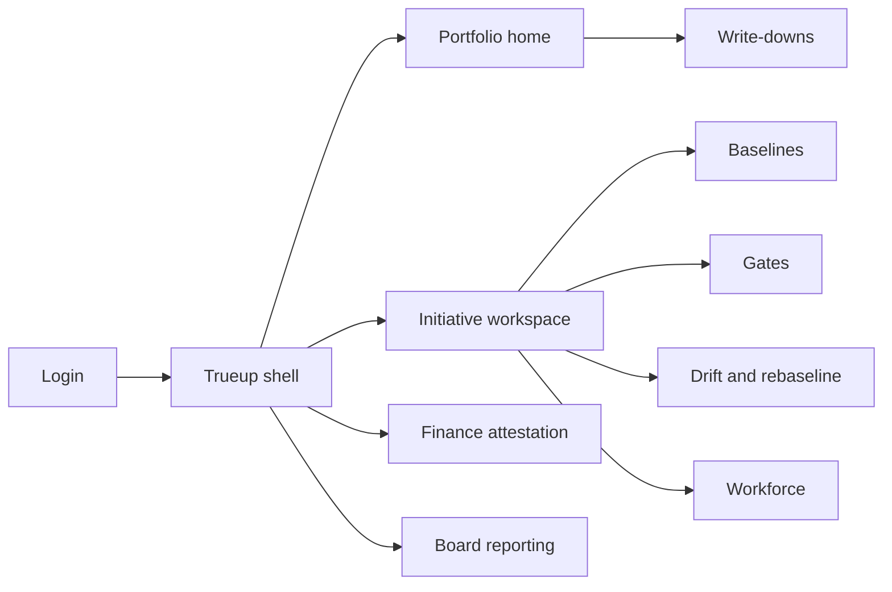
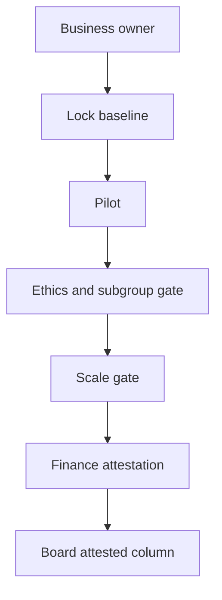

# Trueup — Web app

**Product:** [PRODUCT.md](./PRODUCT.md)
**Primary surface:** AI benefits-realisation programme office console (business owner + finance shell)
**Secondary surfaces:** Board packet export (four-quantity reconciliation); drift-owner workbench
**Design thesis:** Trueup is the system of record for promises made to the board — not an algorithm register and not a Jira portfolio. The unit of account is the baselined claim: locked before pilot, gated before scale, finance-attested before it may be summed, and formally written down when unrealised. Visual language is ledger charcoal and attested-green on cool ash — claimed-but-unattested never mixes into the attested column; write-downs feel routine, not punitive. The Trueup wordmark heads every board view so “announced” cannot be restated as “delivered.”

## UX research synthesis

### Category peers (best-in-class)

- **Anaplan / Adaptive Insights (FP&A):** Baseline lock, versioned forecasts, write-downs. Steal: attested vs unattested columns that never sum together; reject generic FP&A without clinical counter-metrics.
- **ServiceNow SPM / Clarity PPM:** Stage gates and business owners. Steal: owner must hold the operating budget (not IT); reject milestone % complete as benefit proof.
- **LeanIX / SoftExpert benefits modules:** Initiative benefit hypotheses with realisation tracking. Steal: formal write-down cadence; reject hiding negative realisation.
- **Carecensus-class algorithm registers (complement, not clone):** Ethics/fairness evidence consumed by reference. Steal: value gate blocked until subgroup evidence exists elsewhere; reject duplicating model inventory UI here.

### Patterns to adopt / reject

- **Adopt:** Business owner ≠ tech builder; baseline lock pre-pilot; finance attestation vs GL/actuarial; scale gate vs pilot-only; process/data/workforce classification; drift owner + re-baseline; labour savings with quality/safety/access counters; four quantities reconciling to announcement.
- **Reject:** Pilot success as enterprise benefit; summing unattested with attested; purple transformation scorecards; restating history after write-down; ethics caveats instead of hard blocks.

### Trust, density, and workflow constraints from PRODUCT.md

One business owner on the budget line (BR-1). No claim without locked baseline (BR-2). Finance attestation required for board/external (BR-3). Scale gate before enterprise reporting (BR-4). Process reinvention without data/role change reclassified to automation curve (BR-5). Unmeasured subgroup blocks value gate (BR-6). Labour savings show transfers (BR-7). Living process needs drift owner (BR-8). Write-downs are expected governance (BR-9). Vendor-person dependency at-risk (BR-10). Role redesign pre-go-live (BR-11). Four reportable quantities (BR-12).

## Information architecture

### Nav model

### Roles → default home

| Role | Default home | Why |
|------|--------------|-----|
| Programme office / transformation lead | Portfolio home — four quantities | BR-12 |
| Business owner | Initiative workspace | Budget accountability (BR-1) |
| Finance / actuarial | Attestation queue | BR-3 |
| Drift owner | Drift workbench | BR-8 |
| Workforce / HR partner | Workforce impact | BR-11 |
| Board / exec viewer | Board reporting (read-only) | Announced vs attested |

### Cross-links to OpenAPI resources

| Nav area | OpenAPI tags / resources |
|----------|---------------------------|
| Initiatives, owners, stages | Initiatives |
| Locked baselines | Baselines |
| Scale, ethics/value gates | Gates |
| Assurance links to register evidence | Assurance |
| Finance attestation | Attestation |
| Role redesign, capability transfer | Workforce |
| Portfolio concentration and at-risk | Portfolio |
| Board packs, four quantities | Reporting |

## Screen inventory

### Portfolio home

- **Purpose:** Show announced, gated, finance-attested, and written-down as four distinct quantities reconciling to the original announcement.
- **Entry:** Programme default.
- **Layout regions:** Brand; four-quantity strip; at-risk flags; initiatives table by stage; write-down schedule.
- **Primary actions:** Open initiative; generate board pack; open attestation backlog.
- **Empty / loading / error:** Empty portfolio = guided first initiative; never collapse columns.
- **BR / story ties:** BR-12.

### Initiative workspace

- **Purpose:** Single claim object: owner, classification, baseline, gates, realised value, drift.
- **Entry:** Portfolio row.
- **Layout regions:** Header (owner, budget line, stage); process/data/workforce tags; gate rail; claim vs attested; links to register evidence (read-only).
- **Primary actions:** Lock baseline; submit gate; request attestation; write down.
- **Empty / loading / error:** No owner = blocked advancement.
- **BR / story ties:** BR-1, BR-5.

### Baseline lock

- **Purpose:** Lock measurement window, method, cohort, and GL/clinical line before pilot.
- **Entry:** Pre-pilot gate.
- **Layout regions:** Baseline form; lock seal; amendment requires re-gate.
- **Primary actions:** Lock; view history; block claim if unlocked.
- **Empty / loading / error:** Attempted claim without lock = hard refuse.
- **BR / story ties:** BR-2.

### Gates desk

- **Purpose:** Ethics/fairness/safety/auditability gate then value gate; scale gate to leave pilot.
- **Entry:** Initiative → Gates.
- **Layout regions:** Gate types; outcomes; subgroup evidence status from register; pilot vs enterprise replication proof.
- **Primary actions:** Pass/fail with conditions; block value claim if subgroup unmeasured.
- **Empty / loading / error:** Missing register link = cannot open value gate (BR-6).
- **BR / story ties:** BR-4, BR-6.

### Finance attestation

- **Purpose:** Attest realised value against GL or actuarial trend; keep unattested separate.
- **Entry:** Finance queue.
- **Layout regions:** Claim amount; evidence; attested column; unattested column; never-sum warning.
- **Primary actions:** Attest; reject; return to owner.
- **Empty / loading / error:** Empty queue with portfolio unattested total visible.
- **BR / story ties:** BR-3.

### Counter-metrics panel

- **Purpose:** Publish labour savings beside quality, safety, access counters for the same process.
- **Entry:** Initiative assurance.
- **Layout regions:** Savings; harm/wait/transfer indicators; net narrative.
- **Primary actions:** Flag transfer; attach ops evidence.
- **Empty / loading / error:** Savings without counters = incomplete for board.
- **BR / story ties:** BR-7.

### Drift and re-baseline

- **Purpose:** Named drift owner, trigger, and re-baselining obligation for living processes.
- **Entry:** Drift workbench; initiative.
- **Layout regions:** Drift state; trigger definition; re-baseline workflow; silent-revert risk banner.
- **Primary actions:** Acknowledge drift; re-baseline; pause benefit reporting.
- **Empty / loading / error:** Missing drift owner on live initiative = at-risk.
- **BR / story ties:** BR-8.

### Write-downs

- **Purpose:** Formal unrealised benefit write-down on cadence with reason — expected governance.
- **Entry:** Portfolio → Write-downs.
- **Layout regions:** Schedule; reason codes; impact on four quantities; no shame chrome.
- **Primary actions:** Execute write-down; notify board pack.
- **Empty / loading / error:** Overdue write-down cadence = amber duty.
- **BR / story ties:** BR-9.

### Workforce impact

- **Purpose:** Redesigned roles, redeployment, skills; capability transfer from vendors; approve before go-live.
- **Entry:** Initiative → Workforce.
- **Layout regions:** Role redesign approval; at-risk if single contractor; transfer plan.
- **Primary actions:** Approve redesign; clear at-risk when transfer done.
- **Empty / loading / error:** Go-live blocked without role approval (BR-11).
- **BR / story ties:** BR-10, BR-11.

### Board reporting

- **Purpose:** Packet that cannot restate history — four quantities vs original announcement.
- **Entry:** Reporting nav.
- **Layout regions:** Announcement anchor; attested; gated; written-down; methodology footnotes.
- **Primary actions:** Export; as-of freeze.
- **Empty / loading / error:** Freeze failure keeps prior as-of.
- **BR / story ties:** BR-12.

## Key flows

1. **Claim to attested value** — assign business owner → lock baseline → pilot → ethics gate → scale gate → finance attest → board column; failure: unattested stays segregated.

2. **Automation reclassify** — process-reinvention claim without data/role change → reclassify automation → reset benefit expectation to levelling-off curve.

3. **Drift re-baseline** — trigger fires → drift owner acts → re-baseline or pause reporting → prevent silent revert savings.

4. **Scheduled write-down** — cadence due → document reason → reduce unrealised → update four quantities without rewriting announcement.

5. **Workforce gate** — role redesign approval before go-live; single-vendor-person benefit flagged at-risk until transfer.

## Design system

### Tokens (CSS variables)

- `--color-ink: #1A1C1E` — primary text
- `--color-ash: #EEF0F2` — app ground
- `--color-panel: #FFFFFF`
- `--color-ledger: #4A5560` — secondary
- `--color-attested: #1F7A4D` — finance-attested
- `--color-unattested: #8A7A2E` — claimed but unattested (never summed)
- `--color-writedown: #5C6B7A` — write-down (neutral, not failure-red)
- `--color-gate: #C4721A` — pending gate
- `--color-brand: #243038` — Trueup wordmark
- `--font-display: "Libre Franklin", sans-serif` — four-quantity numerals
- `--font-body: "IBM Plex Sans", sans-serif`
- `--font-mono: "IBM Plex Mono", monospace` — claim ids, GL lines
- `--space-1`…`--space-8`: 4px scale
- `--radius-sm: 3px`; `--radius-md: 6px`
- `--motion-attest: 180ms ease-out` — attestation stamp
- `--motion-writedown: 200ms ease-in-out` — quantity adjust
- `--motion-drift: 220ms linear` — drift alert
- Atmosphere: subtle columnar ledger rules; board packet print with frozen as-of.

### Typography & brand

- Display for four quantities; body for initiative prose; mono for GL references.
- Brand on portfolio home and board packet header — stronger than any “AI ROI” title.
- Login: brand-first; headline (“Attest what landed”); one CTA.

### Do / don’t

- **Do:** Segregate unattested; lock baselines; treat write-downs as normal; show counter-metrics; require drift owners.
- **Don’t:** Sum unattested into wins; call pilots enterprise benefits; purple transformation radars; duplicate algorithm inventory.

### Accessibility & domain trust cues

- AA+; unattested vs attested pattern + label.
- Live regions for attestation and write-down events.
- Focus order in attestation: evidence → amount → confirm.

## Component patterns

- **FourQuantityStrip** — announced / gated / attested / written-down.
- **BaselineLockSeal** — pre-pilot immutable seal.
- **UnattestedColumn** — visually excluded from attested totals.
- **ScaleGateCard** — replication outside pilot (interaction container).
- **DriftOwnerBadge** — named owner + trigger.
- **WriteDownReason** — cadence governance event.
- **CounterMetricPair** — labour saving + quality/safety/access.
- **BoardAsOfPacket** — non-restating export.

## Out of scope for v1 web

- Model training/monitoring UI; full PPM resource leveling; general ledger itself; algorithm discovery census (consume via Assurance links); marketing microsites for transformation.
